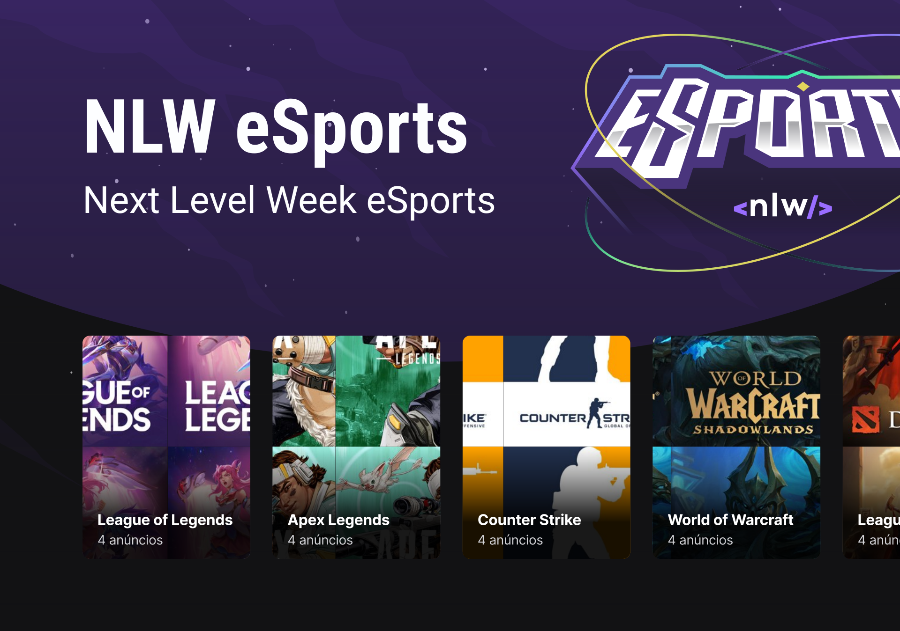

<h1 align="center">
  
</h1>

  

 
 

 

## ✨ Tecnologias

Web

- [React](https://pt-br.reactjs.org/)
- [Typescript](https://www.typescriptlang.org/)
- [Tailwindcss](https://tailwindcss.com/)

Mobile

- [React Native](https://reactnative.dev/)
- [Typescript](https://www.typescriptlang.org/)
- [Expo](https://expo.io/)

Server

- [Node](https://nodejs.org/en/)
- [Typescript](https://www.typescriptlang.org/)
- [Prisma](https://www.prisma.io/)

## 💻 Projeto

Encontre seu duo!

## 🔖 Layout

Você pode visualizar o layout do projeto através [desse link](https://www.figma.com/file/3IwliM7UW66RgDxysWGtoz/NLW-eSports?node-id=0%3A1). É necessário ter conta no [Figma](http://figma.com/) para acessá-lo.

## 📄 Licença

Desenvolvido durante o NLW 09 da Rocketseat **por** [**rafaeld3v**](https://www.linkedin.com/in/rafaeld3v/) 🤖
